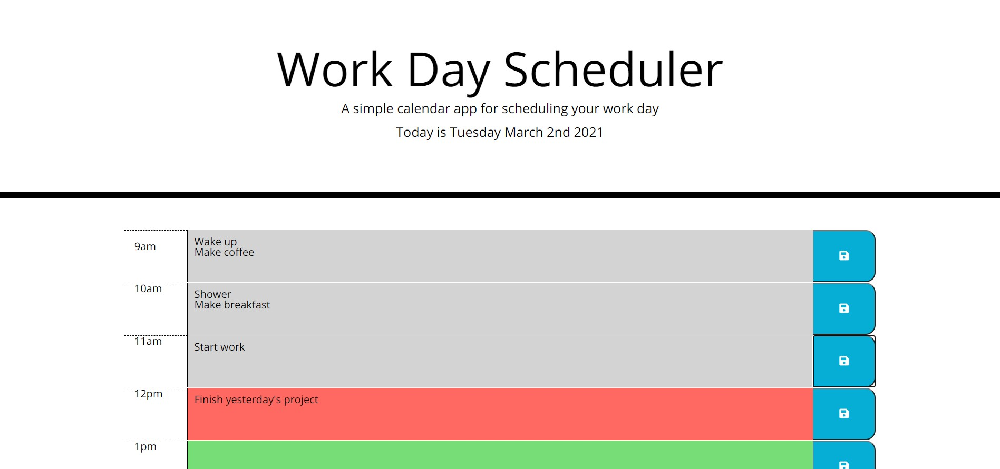

# jQuery_Calender
A dynamic calendar for Homework 5 powered by jQuery

## Description 
The challenge was to build a simple and functional workday calender. I was able to get the bones of the app built but failed to add the full functionality to my program. I hope to continue updating the project and figure out how to solve the problems I have encountered. 

## Deployment
Click the link [here](https://dillonhoban.github.io/jQuery_Calender/) to check out my site in your browser.

## Acknowledgments
A special thank you to [Christina](https://github.com/Christina2021), [Ravi](https://github.com/ravifindravicom), [Brian](https://github.com/btparker70), [Anastasia](https://github.com/anaiva27) and [Emily](https://github.com/ethomas22). Without you fine folks the study group would not be as awesome!

## Validation 
This site’s HTML was validated using a third party service found [here.](https://validator.w3.org/)

  
  
  
  
  

## License
[MIT](https://choosealicense.com/licenses/mit/)